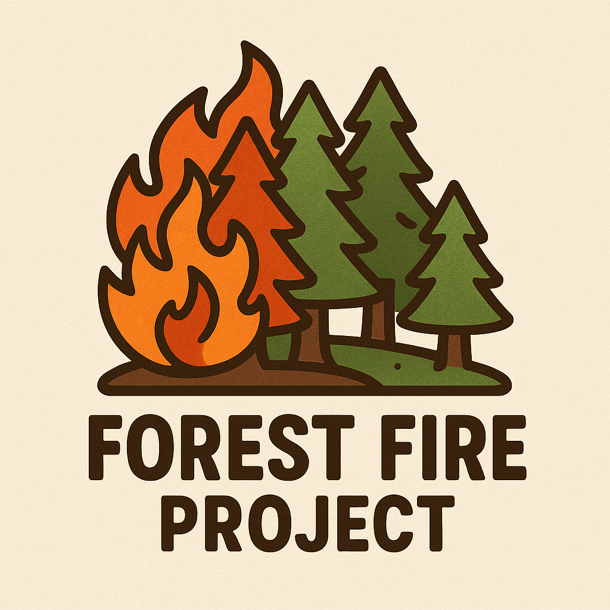

## ForestFireProject

# Forest Fire Project — an educational project in physics
- 24.05.25 — app-plotted.ipynb (Добавил версию программы с графиками к видео симуляции)
- 20.06.25 — Добавил возможность задавать начальное количество горящих клеток, возможность отключать рендеринг и отображение видео процесса горения, добавил +Δp к p у каждой новой симуляции в линии, добавил N_Δf количество ответвлений с +Δf для каждого фиксированного значения p, добавил чекбокс на визуализацию лишь двух последних графиков s числа вырастающих за шаг деревьев к числу деревьев в которые ударила молния от (f/p)^-1 и rho_t доли деревьев от (f/p)
